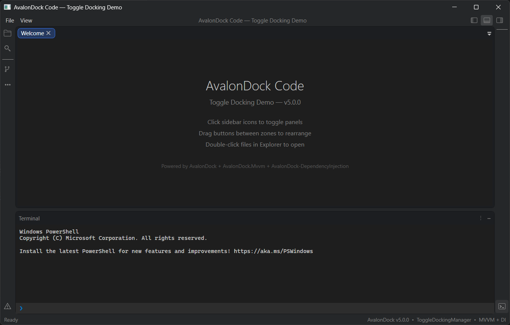
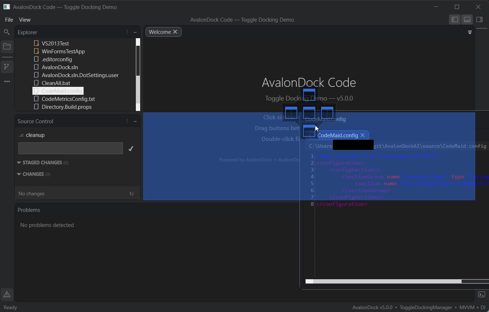
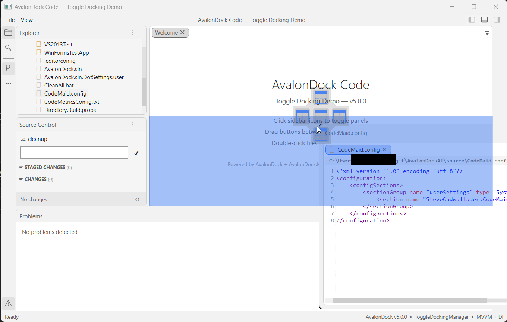
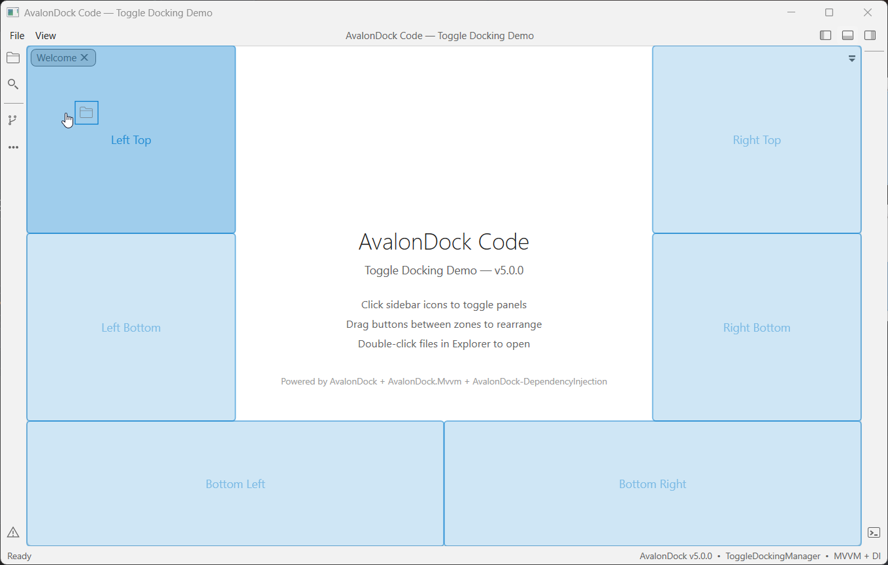
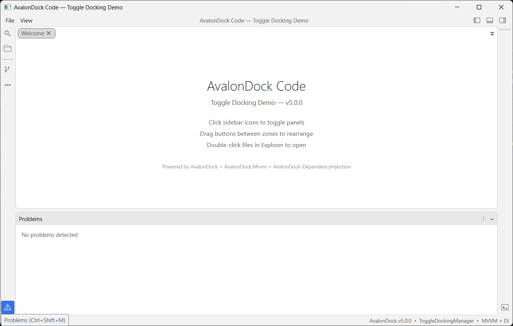
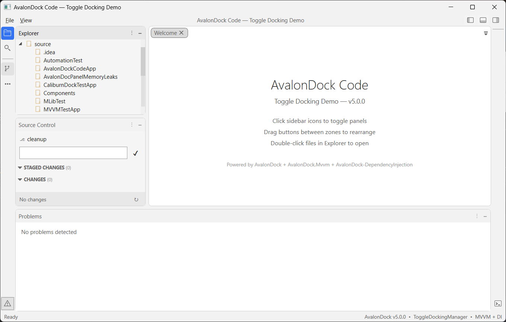

# AvalonDock

[](https://github.com/Dirkster99/AvalonDock/actions/workflows/release.yml)
[](https://github.com/Dirkster99/avalondock/releases/latest)
[](http://nuget.org/packages/Dirkster.AvalonDock)

  

Support this project with a :star: — report an issue, or even better, place a pull request :mailbox: :blush:

AvalonDock is a WPF Document and Tool Window layout container that is used to arrange documents and tool windows in similar ways to many well known IDEs, such as Visual Studio, Eclipse, JetBrains Rider, and more. **Version 5.0** introduces first-class MVVM support, dependency injection integration, and a modular package architecture.

AvalonDock is used by [many open source and commercial projects](https://github.com/search?p=4&q=%22dirkster.avalondock%22&type=Code), including:

- [Stride](https://github.com/stride3d/stride) — Free and open-source cross-platform C# game engine
- [Optick](https://github.com/bombomby/optick) — C++ Profiler for Games
- [RoslynPad](https://github.com/roslynpad/roslynpad) — A cross-platform C# editor based on Roslyn and AvalonEdit
- [WpfDesigner](https://github.com/icsharpcode/WpfDesigner) — The WPF Designer from SharpDevelop
- [DaxStudio](https://github.com/DaxStudio/DaxStudio) — DAX query tool for Power BI and Analysis Services
- [Macad3D](https://github.com/Macad3D/Macad3D) — Free and open-source 3D Construction Tool
- [Edi](https://dirkster99.github.io/Edi/) — Open source text editor IDE based on AvalonDock and AvalonEdit
- [Profile Explorer](https://github.com/microsoft/profile-explorer) — Microsoft CPU profiling trace viewer

Be sure to check out the [Wiki](https://github.com/Dirkster99/AvalonDock/wiki) and the [documentation site](https://dirkster99.github.io/AvalonDock/) for tutorials and API reference.

---

## NuGet Packages

### Core

| Package | Downloads | Description |
|:--------|:----------|:------------|
| [Dirkster.AvalonDock](http://nuget.org/packages/Dirkster.AvalonDock) | [](http://nuget.org/packages/Dirkster.AvalonDock) | Main WPF docking framework package |
| [Dirkster.AvalonDock.Core](http://nuget.org/packages/Dirkster.AvalonDock.Core) | [](http://nuget.org/packages/Dirkster.AvalonDock.Core) | UI-agnostic interfaces and models |
| [Dirkster.AvalonDock.Mvvm](http://nuget.org/packages/Dirkster.AvalonDock.Mvvm) | [](http://nuget.org/packages/Dirkster.AvalonDock.Mvvm) | MVVM base classes (`DockableBase`, `ToolboxBase`, `DockLayoutService`) — no external dependencies |
| [Dirkster.AvalonDock.Mvvm.CommunityToolkit](http://nuget.org/packages/Dirkster.AvalonDock.Mvvm.CommunityToolkit) | [](http://nuget.org/packages/Dirkster.AvalonDock.Mvvm.CommunityToolkit) | CommunityToolkit.Mvvm integration (`ObservableDockableBase`, `ObservableToolboxBase`) with `[ObservableProperty]` support |
| [Dirkster.AvalonDock.DependencyInjection](http://nuget.org/packages/Dirkster.AvalonDock.DependencyInjection) | [](http://nuget.org/packages/Dirkster.AvalonDock.DependencyInjection) | `IServiceCollection` extensions for DI registration |

### Serializers

| Package | Downloads | Description |
|:--------|:----------|:------------|
| [Dirkster.AvalonDock.Serializer.Xml](http://nuget.org/packages/Dirkster.AvalonDock.Serializer.Xml) | [](http://nuget.org/packages/Dirkster.AvalonDock.Serializer.Xml) | XML layout serialization |
| [Dirkster.AvalonDock.Serializer.Json](http://nuget.org/packages/Dirkster.AvalonDock.Serializer.Json) | [](http://nuget.org/packages/Dirkster.AvalonDock.Serializer.Json) | JSON layout serialization (**new in v5**) |

### Themes

| Package | Downloads | Description |
|:--------|:----------|:------------|
| [Dirkster.AvalonDock.Themes.Arc](http://nuget.org/packages/Dirkster.AvalonDock.Themes.Arc) | [](http://nuget.org/packages/Dirkster.AvalonDock.Themes.Arc) | Arc theme **NEW!** |
| [Dirkster.AvalonDock.Themes.Aero](http://nuget.org/packages/Dirkster.AvalonDock.Themes.Aero) | [](http://nuget.org/packages/Dirkster.AvalonDock.Themes.Aero) | Aero theme |
| [Dirkster.AvalonDock.Themes.Expression](http://nuget.org/packages/Dirkster.AvalonDock.Themes.Expression) | [](http://nuget.org/packages/Dirkster.AvalonDock.Themes.Expression) | Expression theme |
| [Dirkster.AvalonDock.Themes.Metro](http://nuget.org/packages/Dirkster.AvalonDock.Themes.Metro) | [](http://nuget.org/packages/Dirkster.AvalonDock.Themes.Metro) | Metro theme |
| [Dirkster.AvalonDock.Themes.VS](http://nuget.org/packages/Dirkster.AvalonDock.Themes.VS) | [](http://nuget.org/packages/Dirkster.AvalonDock.Themes.VS) | Visual Studio Themes (2015, 2022) incl. .vstheme support |
| [Dirkster.AvalonDock.Themes.VS2010](http://nuget.org/packages/Dirkster.AvalonDock.Themes.VS2010) | [](http://nuget.org/packages/Dirkster.AvalonDock.Themes.VS2010) | Visual Studio 2010 theme (Legacy) |
| [Dirkster.AvalonDock.Themes.VS2013](http://nuget.org/packages/Dirkster.AvalonDock.Themes.VS2013) | [](http://nuget.org/packages/Dirkster.AvalonDock.Themes.VS2013) | Visual Studio 2013 theme (Legacy) |

---

## Quick Start

Install the packages you need:

```bash
dotnet add package Dirkster.AvalonDock
dotnet add package Dirkster.AvalonDock.Mvvm
dotnet add package Dirkster.AvalonDock.Mvvm.CommunityToolkit  # optional, for [ObservableProperty] support
dotnet add package Dirkster.AvalonDock.DependencyInjection
dotnet add package Dirkster.AvalonDock.Themes.Arc
```

---

## Docking Manager
The `DockingManager` control is the main entry point for using AvalonDock in your WPF application. It provides the core docking functionality, including layout management, drag-and-drop support, and theme integration.
AvalonDock also includes a `ToggleDockingManager` which adds a built-in sidebar for toggling tool windows, similar to VS Code's or Jetbrains IDE's behavior.

### DockingManager

The standard `DockingManager` provides a blank canvas for custom layouts and is ideal for applications that require full control over the docking behavior and UI.


### ToggleDockingManager

The `ToggleDockingManager` includes a built-in sidebar that automatically populates with registered tool windows (anchorable view models). This is perfect for applications that want a modern, out-of-the-box docking experience without manual layout management.


## Dependency Injection

The `AvalonDock.DependencyInjection` package provides `IServiceCollection` extension methods to wire up the entire docking system through your DI container. This replaces manual `DocumentsSource`/`AnchorablesSource` binding with a clean, service-oriented composition root.

### Extension Methods

| Method | Purpose |
|:-------|:--------|
| `AddDockLayoutService(configure)` | Register `IDockLayoutService` with a builder to configure toolboxes and toggle dock options in a single call |
| `AddDockLayoutService()` | Register `IDockLayoutService` without builder configuration |
| `AddAvalonDock<TFactory>()` | Register a custom `IFactory` implementation |
| `AddAvalonDockSerializer<T>()` | Register an `ILayoutSerializer` (XML or JSON) |
| `AddAvalonDockThemeManager<T>()` | Register a theme manager |
| `AddDockingManager(factory)` | Register an `IDockingManager` wrapper |
| `AddAutoHideManager<T>()` | Register an auto-hide manager |
| `AddFloatingWindowService<T>()` | Register a floating window service |
| `AddDragDropHandler<T>()` | Register a custom drag-and-drop handler |

#### DockLayoutBuilder Methods

| Method | Purpose |
|:-------|:--------|
| `ConfigureToggleDock(configure)` | Configure sidebar button size, default dock dimensions, and layout priority |
| `AddToolbox<T>()` | Register a toolbox (anchorable) view model as a singleton |
| `AddToolbox<T>(factory)` | Register a toolbox with a custom factory for constructor parameters |

### Composition Root Example

```csharp
using AvalonDock.Core;
using AvalonDock.DependencyInjection;
using Microsoft.Extensions.DependencyInjection;

public partial class App : Application
{
    private IServiceProvider? _serviceProvider;

    protected override void OnStartup(StartupEventArgs e)
    {
        base.OnStartup(e);

        var services = new ServiceCollection();

        // Configure dock layout: toggle dock options + toolboxes in one call
        services.AddDockLayoutService(dock =>
        {
            dock.ConfigureToggleDock(opts =>
            {
                opts.ButtonSize = 28;
                opts.DefaultDockWidth = 280;
                opts.DefaultDockHeight = 220;
                opts.LayoutPriority = nameof(AvalonDock.DockLayoutPriority.BottomFullWidth);
            });

            dock.AddToolbox<ExplorerToolbox>();
            dock.AddToolbox<SearchToolbox>();
            dock.AddToolbox<TerminalToolbox>();
        });

        services.AddSingleton<MainViewModel>();
        services.AddSingleton<MainWindow>();

        _serviceProvider = services.BuildServiceProvider();
        _serviceProvider.GetRequiredService<MainWindow>().Show();
    }

    protected override void OnExit(ExitEventArgs e)
    {
        (_serviceProvider as IDisposable)?.Dispose();
        base.OnExit(e);
    }
}
```

### Layout Priority Options

The `LayoutPriority` setting controls how panels are arranged when multiple panels are docked:

| Priority | Behavior | Similar To |
|:---------|:---------|:-----------|
| `BottomFullWidth` | Bottom panel spans the full window width | JetBrains Rider |
| `SidesFullHeight` | Side panels span the full window height | VS Code |
| `Default` | No automatic restructuring | Classic AvalonDock |

For a complete walkthrough, see the [Dependency Injection tutorial](docs/tutorials/dependency-injection-app.md).

---

## MVVM

The `AvalonDock.Mvvm` package provides ready-to-use view model base classes with zero external dependencies. These classes implement the core interfaces from `AvalonDock.Core` and handle property change notifications, serialization attributes, and docking behavior out of the box.

For projects using [CommunityToolkit.Mvvm](https://github.com/CommunityToolkit/dotnet) source generators (`[ObservableProperty]`, `[RelayCommand]`), install the optional `AvalonDock.Mvvm.CommunityToolkit` package which provides `ObservableObject`-based equivalents.

### Base Classes

**`AvalonDock.Mvvm`** (no external dependencies):

| Class | Purpose |
|:------|:--------|
| `DockableBase` | Base for all dockable view models — provides `Id`, `Title`, `CanClose`, `CanFloat`, `CanPin`, `IsModified`, `DockState`, and more |
| `ToolboxBase` | Base for toolbox (anchorable) view models — adds `Zone`, `IsOpenByDefault`, `ToolTipText`, and `Icon` |
| `DockBase` | Container for multiple dockables — manages `VisibleDockables`, `ActiveDockable`, and navigation |
| `RootDock` | Root of the layout tree — manages floating and pinned dockables |
| `DocumentDock` | Container for document tabs |
| `ToolDock` | Container for tool windows with `Alignment` and `AutoHide` support |

**`AvalonDock.Mvvm.CommunityToolkit`** (requires CommunityToolkit.Mvvm):

| Class | Purpose |
|:------|:--------|
| `ObservableDockableBase` | `ObservableObject`-based equivalent of `DockableBase` — supports `[ObservableProperty]` and `[RelayCommand]` |
| `ObservableToolboxBase` | `ObservableObject`-based equivalent of `ToolboxBase` |
| `ObservableDockBase` | `ObservableObject`-based equivalent of `DockBase` |
| `ObservableDocument` / `ObservableTool` | Leaf dockable classes for documents and tools |

### Creating a Toolbox View Model

Using `AvalonDock.Mvvm` (no external dependencies):

```csharp
using AvalonDock.Core;
using AvalonDock.Mvvm;

public class ExplorerToolbox : ToolboxBase
{
    public ExplorerToolbox()
    {
        Id = "Explorer";
        Title = "Explorer";
        Zone = DockZone.LeftTop;        // Sidebar placement zone
        IsOpenByDefault = true;          // Open when app starts
        ToolTipText = "Solution Explorer";
    }
}
```

Using `AvalonDock.Mvvm.CommunityToolkit` (with `[ObservableProperty]` support):

```csharp
using AvalonDock.Core;
using AvalonDock.Mvvm.CommunityToolkit;
using CommunityToolkit.Mvvm.ComponentModel;

public partial class ExplorerToolbox : ObservableToolboxBase
{
    [ObservableProperty] private string _searchFilter = string.Empty;

    public ExplorerToolbox()
    {
        Id = "Explorer";
        Title = "Explorer";
        Zone = DockZone.LeftTop;
        IsOpenByDefault = true;
        ToolTipText = "Solution Explorer";
    }
}
```

### Dock Zones

Toolboxes declare their sidebar placement using `DockZone`:

| Zone | Position |
|:-----|:---------|
| `LeftTop` / `LeftBottom` | Left sidebar |
| `RightTop` / `RightBottom` | Right sidebar |
| `BottomLeft` / `BottomRight` | Bottom panel |

### IDockLayoutService

`IDockLayoutService` is the central service for managing documents and toolboxes at runtime:

```csharp
public class MainViewModel
{
    private readonly IDockLayoutService _dockService;

    public MainViewModel(IDockLayoutService dockService)
    {
        _dockService = dockService;
    }

    // Open a new document
    public void OpenFile(string filePath)
    {
        _dockService.OpenOrActivateDocument(
            existing => existing.FilePath == filePath,
            () => new EditorTabViewModel { Title = Path.GetFileName(filePath) });
    }

    // Close a document
    public void CloseFile(IDockable document) => _dockService.CloseDocument(document);

    // Access a registered toolbox by type
    public ExplorerToolbox? Explorer => _dockService.GetAnchorable<ExplorerToolbox>();

    // Iterate all open documents
    public IEnumerable<IDockable> Documents => _dockService.Documents;

    // Bind this to ToggleDockingManager.DockLayout in XAML
    public IRootDock DockLayout => _dockService.Layout;
}
```

### XAML Binding

For the `ToggleDockingManager`, bind the `DockLayout` property to your view model:

```xml
<avalonDock:ToggleDockingManager x:Name="dockManager"
    DockLayout="{Binding DockLayout}"
    LayoutItemContainerStyleSelector="{StaticResource PanesStyleSelector}" />
```

For the classic `DockingManager`, bind the `DockLayout` to the `Layout` property:

```xml
<avalonDock:DockingManager x:Name="dockManager"
    Layout="{Binding DockLayout}"
    LayoutItemContainerStyleSelector="{StaticResource PanesStyleSelector}" />
```
---

## Architecture (v5.0)

AvalonDock v5 is organized into modular packages with clear separation of concerns:

```
AvalonDock.Core            UI-agnostic interfaces (IDockable, IDock, IFactory, IToolbox, etc.)
  └── netstandard2.0       Cross-platform abstractions

AvalonDock.Mvvm            MVVM base classes (DockableBase, ToolboxBase, etc.) — no external deps
  └── netstandard2.0

AvalonDock.Mvvm.CommunityToolkit  CommunityToolkit.Mvvm integration ([ObservableProperty] support)
  └── netstandard2.0

AvalonDock.DependencyInjection  IServiceCollection extensions
  └── netstandard2.0

AvalonDock                 WPF docking library (DockingManager, ToggleDockingManager)
  ├── net9.0-windows
  ├── net10.0-windows
  └── net48

AvalonDock.Serializer.Xml  XML layout persistence (extracted from core in v5)
AvalonDock.Serializer.Json JSON layout persistence (new in v5)
AvalonDock.Themes.*        Theme packages (Arc, Aero, Expression, Metro, VS2010, VS2013)
```

## Theming

### Arc Theme (NEW!)

Modern theme with compact tabs, rounded corners, and semi-transparent design elements:

```csharp
dockManager.Theme = new ArcDarkTheme();  // Dark mode
dockManager.Theme = new ArcLightTheme(); // Light mode
```

### VS2013 Theme

Classic Visual Studio 2013 look with Dark, Light, and Blue variants:

```csharp
dockManager.Theme = new Vs2013DarkTheme();
dockManager.Theme = new Vs2013LightTheme();
dockManager.Theme = new Vs2013BlueTheme();
```

### Other Themes

- **VS2010** — Visual Studio 2010 style
- **Expression Dark/Light** — Expression Blend inspired
- **Metro** — Modern Metro/WinUI style
- **Aero** — Classic Windows Aero theme

---

## Migrating from v4.x

Version 5.0.0 includes several breaking changes. See the full [Breaking Changes](docs/migration/breaking-changes.md) guide.

### Key Changes

| Change | Impact | Action |
|:-------|:-------|:-------|
| XML serializer moved to `AvalonDock.Serializer.Xml` | High | Install serializer package, update `using` statements |
| Namespace `AvalonDock.Layout.Serialization` → `AvalonDock.Serializer.Xml` | High | Update `using` statements |
| .NET Framework < 4.8 dropped | High | Upgrade target framework |
| .NET Core 3.x / 5 dropped | High | Upgrade target framework |
| `ILayoutEngine` introduced | Low | No action for default behavior |

### Supported Frameworks

- **.NET Framework 4.8**
- **.NET 9.0** (`net9.0-windows`)
- **.NET 10.0** (`net10.0-windows`)

---

## Building from Source

This project requires **Windows** (WPF is Windows-only) and **.NET SDK 9.0.x / 10.0.x**.

```bash
dotnet restore source/AvalonDock.sln
dotnet build source/AvalonDock.sln --configuration Release --no-restore
dotnet test source/AvalonDock.sln --configuration Release --no-restore -m:1
```

See [CONTRIBUTING.md](CONTRIBUTING.md) for more details.

---

## Screenshots

### ToggleDockingManager
<table width="100%">
   <tr>
      <td>Description</td>
      <td>Dark</td>
      <td>Light</td>
   </tr>
   <tr>
      <td>Dock Document</td>
      <td></td>
      <td></td>
   </tr>
   <tr>
      <td>Dock Tool Window</td>
      <td></td>
      <td></td>
   </tr>
   <tr>
      <td>Document</td>
      <td></td>
      <td></td>
   </tr>
   <tr>
      <td>Tool Window</td>
      <td></td>
      <td></td>
   </tr>
</table>

### Classic DockingManager
<table width="100%">
   <tr>
      <td>Description</td>
      <td>Dark</td>
      <td>Light</td>
   </tr>
   <tr>
      <td>Dock Document</td>
      <td></td>
      <td></td>
   </tr>
   <tr>
      <td>Dock Document</td>
      <td></td>
      <td></td>
   </tr>
   <tr>
      <td>Dock Tool Window</td>
      <td></td>
      <td></td>
   </tr>
   <tr>
      <td>Document</td>
      <td></td>
      <td></td>
   </tr>
   <tr>
      <td>Tool Window</td>
      <td></td>
      <td></td>
   </tr>
</table>

---

## Release History

For detailed release notes and version history, see the [GitHub Releases](https://github.com/Dirkster99/AvalonDock/releases) page.

## More Resources

- [Documentation](docs/)
- [Project Wiki](https://github.com/Dirkster99/AvalonDock/wiki)
- [DI Tutorial](docs/tutorials/dependency-injection-app.md)
- [Breaking Changes (v5.0)](docs/migration/breaking-changes.md)
- [Contributing Guidelines](CONTRIBUTING.md)
- [License (MS-PL)](LICENSE)
